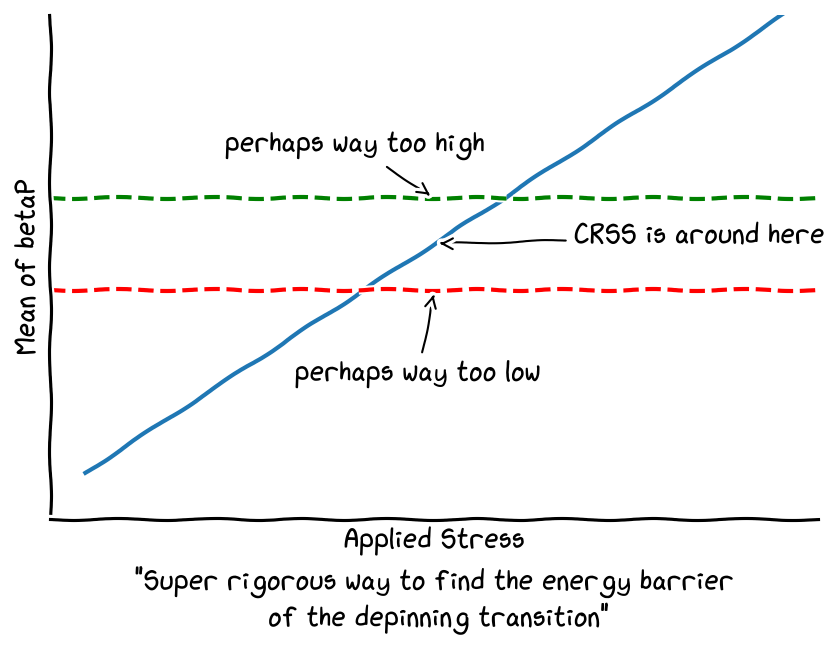

# README.md for Dislocation Dynamics Simulation Script

## Warning
Make sure to back up the generated data. This script automatically removes the old data to prevent corrupting the results.

## Overview
This script is designed to run dislocation dynamics simulations using a specified configuration and a range of test parameters. It utilizes a configuration file to set up the environment and paths, and a Python script (```main.py```) to execute simulations across different test conditions.

## Table of Contents

1. [Requirements](#requirements)
2. [Installation](#installation)
3. [Configuration](#configuration)
4. [Usage](#usage)
5. [Structure](#structure)

## Prerequisites
- Python 3.x
- MoDELib2
- JSON library for Python (usually included in standard Python installations)

## Configuration File
The configuration file (```config.json```) contains essential paths and settings for the simulation. Here's a brief overview of its contents:

- ```mainMoDELibDirectory```: Path to the MoDELib2 library.
- ```dataOutPutDirectory```: Directory where simulation outputs will be stored.
- ```testTimeSteps```: The number of steps to test CRSS.
- ```totalTimeSteps```: The total number of steps to run once CRSS is found.
- ```microstructureFileToUse```: Microstructure executable file path.
- ```enablePartial```: Enable partial simulations (1 for true, 0 for false).
- ```loadType```: Type of load applied in the simulation.
- ```paramtersToCouple```: Parameters to couple (if any), not implemented yet.

## Test Parameters
The ```testRange``` dictionary in the Python script defines the range of parameters to be tested in the simulation. The main code will generate all possible combinations of these parameters, then test various stress values until the Critical Resolved Shear Stress (CRSS) is found.

- ```temperature```: List of temperatures to test.
- ```alloy```: List of alloys.
- ```lineTension```: List of line tensions.
- ```boxSize```: List of box sizes.
- ```periodicDipoleSlipSystemIDs```: List of slip system IDs.
- ```periodicDipoleExitFaceIDs```: Exit face IDs.
- ```periodicDipoleNodes```: Nodes for the periodic dipole.
- ```periodicDipolePoints```: Points defining the periodic dipole.
- ```periodicDipoleHeights```: Heights of the periodic dipole.
- ```periodicDipoleGlideSteps```: Glide steps for the periodic dipole.

### CRSS Searching Algorithm



## Running the Script
To run the simulation script, follow these steps:

1. **Set Up Configuration File**: Ensure that ```config.json``` is correctly set up with paths and parameters as per your system and requirements.

2. **Modify Test Parameters**: Adjust the ```testRange``` dictionary in the ```main.py``` script to include the parameters you want to test.

3. Configure the simulation by using the reference files in the ```ReferenceInputFiles``` directory.

4. **Execute the Script**:
   ```bash
   python main.py
   ```

   This will initiate the simulation process across the specified range of test parameters. The results will be saved in the directory specified in the configuration file.

## Output
The output of the simulations will be stored in the directory specified by ```dataOutPutDirectory``` in the configuration file. Check this directory for results after running the simulations.

## Troubleshooting
- Ensure all paths in the configuration file are correct and accessible.
- Verify that the MoDELib2 library and all required dependencies are properly installed.
- Check if the executable files are compiled and available.

For further assistance or contribution, open an issue or pull request.
